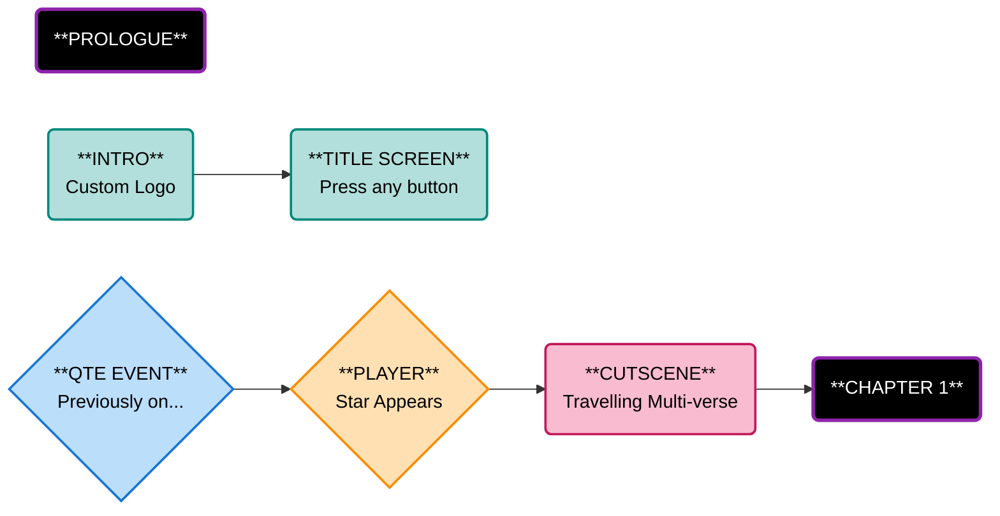
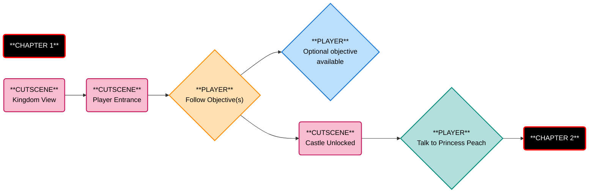
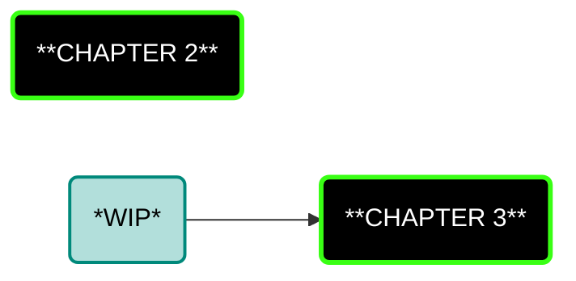

**DISCLAIMER**

This project is intended for educational and learning purposes only. Users who wish to play the game must build it themselves if I decided to release the source code, as no executable files will be provided.

I strictly discourage any illegal use of tools, assets, or files associated with this project. Please respect all applicable copyright and intellectual property laws.

-----------

**Current Status** 

Very early development stage

----------

**Development Log**

Development process, techniques and other knowledge sharing will be documented here [Dev Logs](DevLog/)

----------

**Game Story Flow**

----------

----------

-----------

**CREDITS**

X: @_SnakePlissken1 - For helping me get started and the ongoing support
